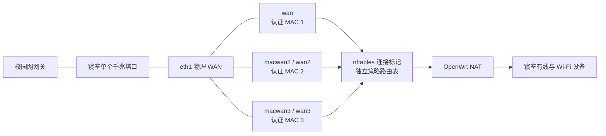

# HITwh 寝室校园网多路聚合

在哈尔滨工业大学（威海）寝室的一个有线网口上，通过 OpenWrt `macvlan` 创建多个独立 MAC/DHCP 会话，并用 nftables 与策略路由进行**按连接负载均衡**。当校园网按已认证终端独立限速时，三个已认证 MAC 可以让多线程下载和多设备并发流量达到接近三倍的持续总带宽。

> 本项目只用于本人账号或明确获授权的校园网终端。请遵守学校网络使用规定。项目不会绕过认证，也不会保存账号和密码。

## 已验证环境

- 校区：哈尔滨工业大学（威海）
- 接入：寝室墙上有线网口，DHCP 获取 `10.240.0.0/16` 地址
- 网关：`10.240.255.254`
- 认证：锐捷 ePortal，未认证终端会跳转到 `172.26.156.158/eportal/`
- 限速：约 5 MB/s/已认证终端，多个终端的限速彼此独立
- 路由器：中国移动 RAX3000M NAND 版，OpenWrt 24.10 系固件
- 三路结果：多连接下载的持续总速度可接近 `3 × 5 MB/s`

其他楼宇、年级或时间段的认证策略可能不同。先确认同一墙口允许多个 MAC 获取 DHCP 地址，并确认不同终端的限速彼此独立。

## 所需设备

1. 一台 **RAX3000M** 路由器，闲鱼价格约 140 元。NAND 版已经足够，不需要 eMMC、USB 口或外置交换机。
2. 一台可以修改有线网卡 MAC 地址的电脑，用于依次认证三个 MAC。
3. 三个允许同时在线的校园网终端名额。优先使用本人账号允许的设备数；使用他人账号前必须获得本人授权。

路由器固件需要包含：

- `kmod-macvlan`
- `nftables`/`firewall4`
- `ip-full`
- `curl`
- `jsonfilter`

## 工作原理



每个新 TCP/UDP 连接随机选择一条在线线路，连接跟踪标记保证同一连接始终从原线路返回。后台每 30 秒检查一次 HTTPS `204` 响应，认证失效的线路自动退出池，恢复后自动加入。

这不是逐包链路绑定。单个 TCP 连接仍然只能使用一条线路；百度网盘、Steam、BT、启动器、多设备并发等多连接场景最容易获得叠加效果。

## 第一步：准备并认证三个 MAC

可使用三个本地管理、单播 MAC，例如：

```text
02:11:22:33:44:51
02:11:22:33:44:52
02:11:22:33:44:53
```

不要直接照抄示例；请修改后几组十六进制数字，避免与同楼设备冲突。首字节使用 `02` 可以保证它是本地管理的单播地址。

依次完成三次认证：

1. 拔掉路由器 WAN，将电脑直接接到寝室墙口。
2. 把电脑有线网卡改为第一个 MAC。
3. 禁用并重新启用网卡，确保重新申请 DHCP 地址。
4. 打开 `http://neverssl.com`，等待跳转至 HITwh 锐捷认证页。
5. 使用本人或获授权账号登录，并开启“无感知认证/无感知登录”。
6. 确认该 MAC 可以直接访问 HTTPS 网站。
7. 换成第二、第三个 MAC，重复上述操作。

认证某个 MAC 时，路由器不能同时使用这个 MAC，否则会产生二层地址冲突。不要保存或分享带完整查询参数的认证 URL。

Windows 的“网络地址/Network Address”属性通常要求填写不带冒号的形式，例如 `021122334451`。全部认证完成后，把电脑网卡恢复为原始 MAC。

## 第二步：安装

路由器接回墙口，电脑连接路由器 LAN，然后 SSH 登录：

```sh
ssh root@192.168.100.1
```

在线安装：

```sh
curl -fsSL https://raw.githubusercontent.com/ponder-j/hitwh-dorm-multiwan/main/install.sh -o /tmp/install.sh
sh /tmp/install.sh
```

也可以克隆仓库后，把整个目录复制到路由器并运行本地 `install.sh`。

安装器会：

- 备份 `/etc/config/network` 与 `/etc/config/firewall`
- 安装管理、健康检查和开机启动脚本
- 建立独立 nftables 表与策略路由规则
- 关闭可能绕过连接标记的软硬件流量分载
- 将自定义文件加入 OpenWrt 升级保留列表

## 第三步：加入三条线路

将第一个已认证 MAC 设置为主 WAN：

```sh
hitwh-mwan set-main 02:11:22:33:44:51
```

加入另外两个已认证 MAC：

```sh
hitwh-mwan add 02:11:22:33:44:52
hitwh-mwan add 02:11:22:33:44:53
```

查看结果：

```sh
hitwh-mwan list
```

预期输出类似：

```text
active_count:3
active_interfaces: wan wan2 wan3
wan  ... state=active mark=0x101
wan2 ... state=active mark=0x102
wan3 ... state=active mark=0x103
```

`state=inactive` 通常表示该 MAC 尚未完成无感知认证；`state=no-dhcp` 表示墙口没有为它返回 DHCP 租约。

## 后续扩展与管理

添加一个新的已认证 MAC：

```sh
hitwh-mwan add AA:BB:CC:DD:EE:FF
```

脚本会自动选择下一个 `wanN`，创建 macvlan、申请 DHCP、加入防火墙和均衡池。默认最多支持 16 条线路，包括主 WAN。

```sh
# 查看并重新检查全部线路
hitwh-mwan list
hitwh-mwan refresh

# 删除一条线路，三种写法均可
hitwh-mwan remove wan4
hitwh-mwan remove 4
hitwh-mwan remove AA:BB:CC:DD:EE:FF

# 观察墙口真实接收速度；按 Ctrl+C 停止
hitwh-mwan speed

# 观察 30 秒
hitwh-mwan speed 30
```

## 本地可视化监控

仓库中的 `dashboard` 是一个不依赖第三方 Python 包的本地网页仪表盘。它通过一条持久 SSH 连接，每 2 秒读取一次路由器已有的状态文件、网卡字节计数和系统负载；浏览器关闭、切到后台或点击暂停后会停止采样。路由器不运行 Web 服务，也不会执行测速。

macOS 或 Linux：

```sh
./dashboard/start.command
```

Windows PowerShell：

```powershell
.\dashboard\start.ps1
```

也可以直接运行：

```sh
python3 dashboard/server.py --router root@192.168.100.1
```

仪表盘默认只监听本机 `127.0.0.1:8765`，并自动打开浏览器。它使用现有 SSH 密钥或 SSH Agent，不保存路由器密码。页面显示总下载/上传、每条线路的实时速度和占比、在线状态、CPU、内存及连接跟踪使用量。

## 性能边界

- 每条线路约 5 MB/s 时，三路理论持续总量约 15 MB/s。
- 所有虚拟线路共用一个千兆墙口，物理极限为 1 Gbit/s；实际 TCP 有效速度通常低于 125 MB/s。
- RAX3000M 使用双核 Cortex-A53。为了保证策略路由，项目关闭流量分载；线路很多、总流量达到数百 Mbit/s 后，CPU 软件 NAT 可能先成为瓶颈。
- 校园网还可能限制单墙口总带宽、允许的 MAC 数、DHCP 租约数或账号在线设备数。
- 限速器的启动瞬时突发不能变成持续带宽。长期速度仍取决于每个认证终端的稳定限速之和。

更多解释见 [原理与性能边界](docs/principles.md)。遇到问题请看 [故障排查](docs/troubleshooting.md)。

## 卸载

```sh
curl -fsSL https://raw.githubusercontent.com/ponder-j/hitwh-dorm-multiwan/main/uninstall.sh -o /tmp/uninstall.sh
sh /tmp/uninstall.sh
```

卸载器只删除本项目创建的 `wan2`–`wanN` 与脚本，保留主 WAN 的 MAC。配置备份保存在 `/root/hitwh-mwan-backups/`。

## 安全与隐私

- 项目不需要校园网账号、密码，也不会自动提交认证表单。
- 不要把 `/etc/config/network` 直接上传到 Issue，其中可能含固件向导遗留的敏感字段。
- 示例、日志和 Issue 中应遮盖账号、真实 MAC、认证 URL 参数与内网地址。
- 只添加本人或明确获授权使用的认证终端。

## 开发检查

```sh
make check
```

项目采用 [MIT License](LICENSE)。
